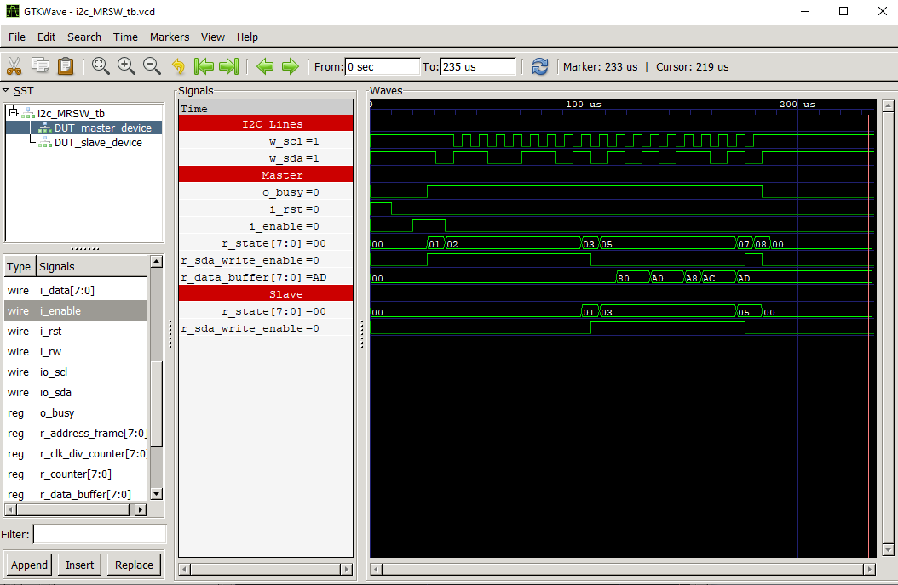
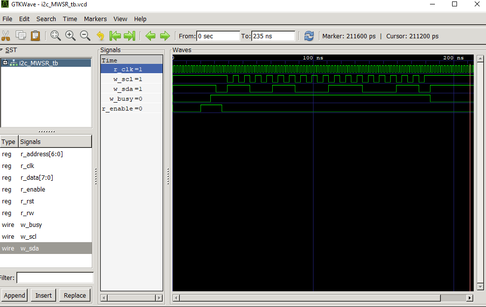

# I2C-Protocol

Controller - Peripheral communication using I2C protocol, in Verilog.
# Simulation
## Master Reads - Slave Writes

## Master Writes - Slave Reads

### Peripheral's Address
| 1 | 1 | 0 | 0 | 1 | 1 | 0 |
|---|---|---|---|---|---|---|

+ Enable signal is set high for 15ns;
+ START condition by pulling SDA low while SCL is high;
+ Sending addres 'b1100110 with rw = 0 (WRITE mode) through SDA;
+ Slave (Peripheral) device compares its address, then sends ACK bit;
+ Master (Controller) receives ACK, continues SCL and reads SDA;
+ Master device starts transmitting data byte 'b11100011 = 'hE3;
+ Slave device read and store data byte, and sends ACK;
+ Master executes STOP condition.
